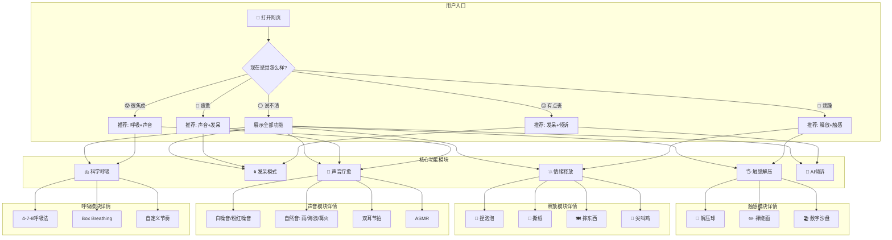
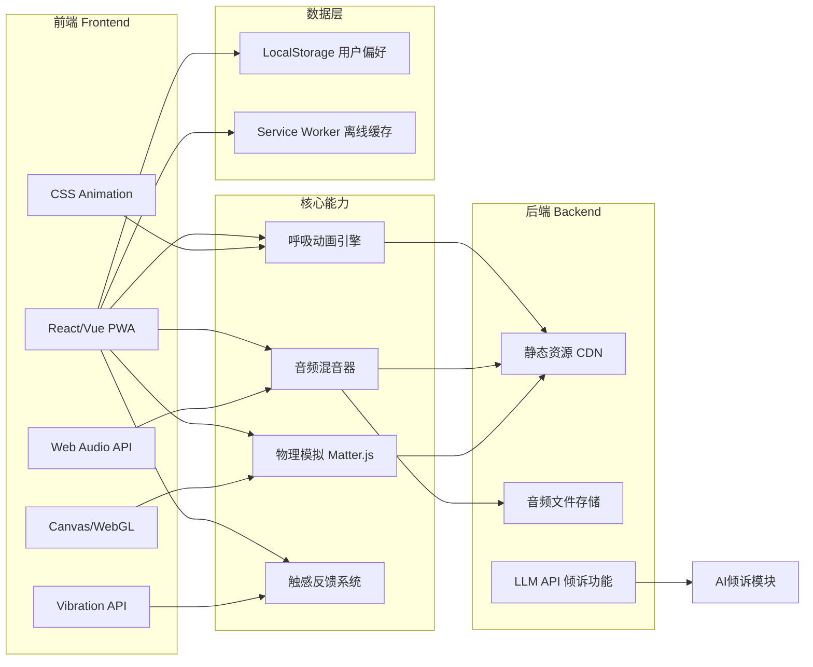
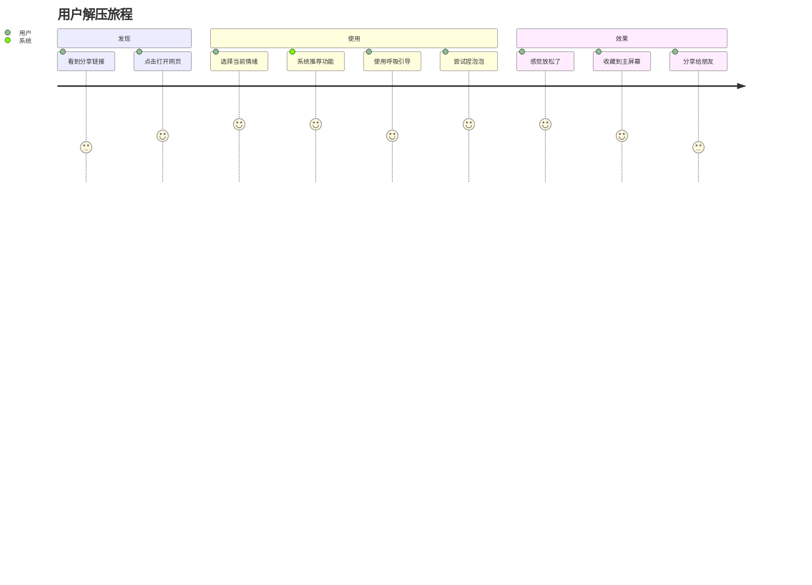
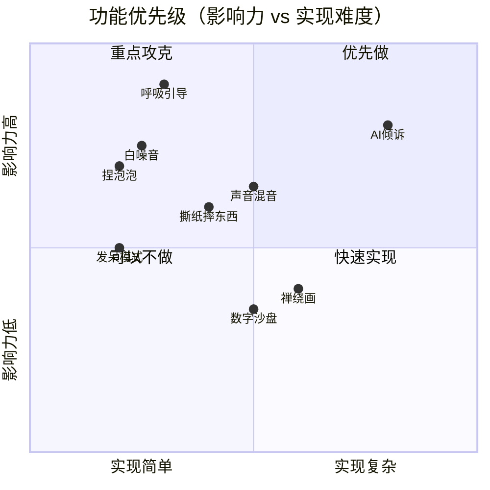
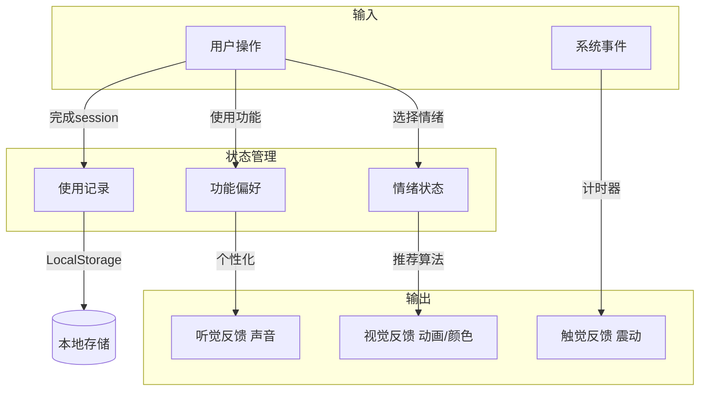
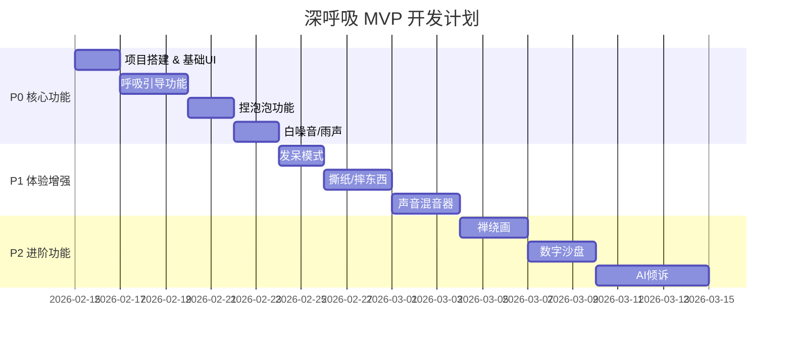

# 🧠 深呼吸 - 产品架构图

## 整体产品框架



## 技术架构



## 用户旅程



## 功能优先级矩阵



## 数据流



---

## 页面结构图

```
┌────────────────────────────────────────────────────────┐
│                      深呼吸 App                         │
├────────────────────────────────────────────────────────┤
│                                                        │
│  ┌─────────────────────────────────────────────────┐  │
│  │              情绪选择入口                         │  │
│  │   😰  😔  😤  🥱  😶                            │  │
│  └─────────────────────────────────────────────────┘  │
│                          │                             │
│                          ▼                             │
│  ┌─────────────────────────────────────────────────┐  │
│  │              功能模块区                           │  │
│  │  ┌──────┐ ┌──────┐ ┌──────┐                    │  │
│  │  │ 呼吸  │ │ 发呆  │ │ 释放  │                    │  │
│  │  └──────┘ └──────┘ └──────┘                    │  │
│  │  ┌──────┐ ┌──────┐ ┌──────┐                    │  │
│  │  │ 声音  │ │ 触感  │ │ 倾诉  │                    │  │
│  │  └──────┘ └──────┘ └──────┘                    │  │
│  └─────────────────────────────────────────────────┘  │
│                          │                             │
│                          ▼                             │
│  ┌─────────────────────────────────────────────────┐  │
│  │              功能详情页                           │  │
│  │                                                  │  │
│  │    ┌────────────────────────────────────────┐   │  │
│  │    │                                        │   │  │
│  │    │         [功能交互区]                    │   │  │
│  │    │                                        │   │  │
│  │    │    呼吸圆 / 泡泡 / 波形 / 画布          │   │  │
│  │    │                                        │   │  │
│  │    └────────────────────────────────────────┘   │  │
│  │                                                  │  │
│  │    ┌────────────────────────────────────────┐   │  │
│  │    │  [控制栏] 时长 | 设置 | 返回            │   │  │
│  │    └────────────────────────────────────────┘   │  │
│  └─────────────────────────────────────────────────┘  │
│                                                        │
└────────────────────────────────────────────────────────┘
```

---

## MVP 实现路径


